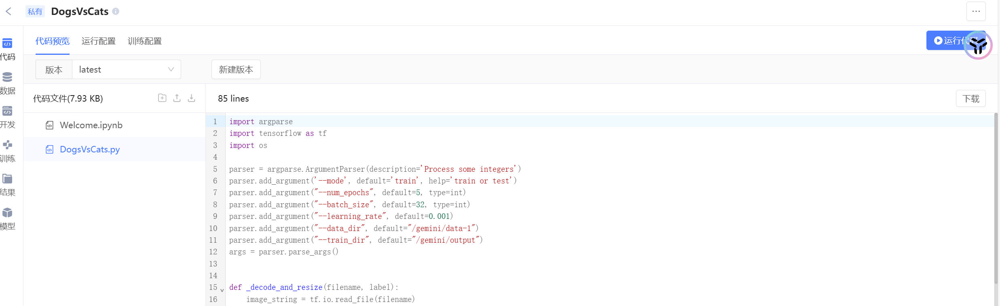
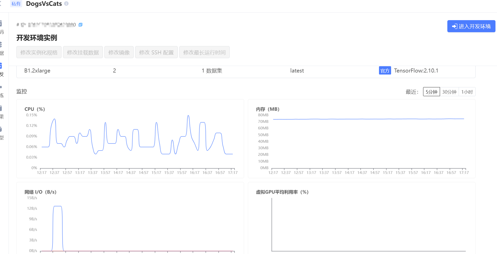
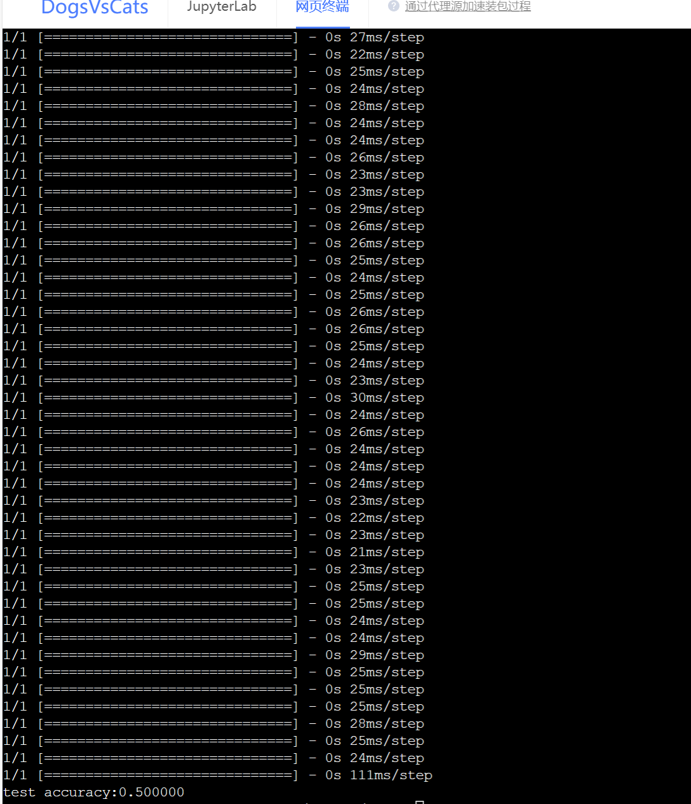
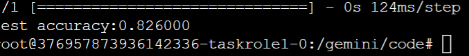
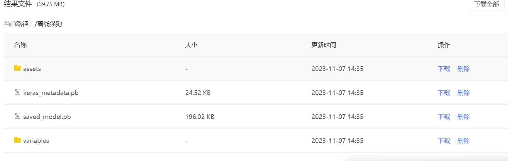

# 环境配置

成功创建项目并配置云环境, 上传代码



创建成功



# 调试

```shell
python $GEMINI_RUN/DogsVsCats.py --num_epochs 5 --data_dir $GEMINI_DATA_IN1/DogsVsCats/ --train_dir $GEMINI_DATA_OUT
```

- 初步运行结果



- 识别成功



- 提交离线任务


- 运行成功


### 模型保存



