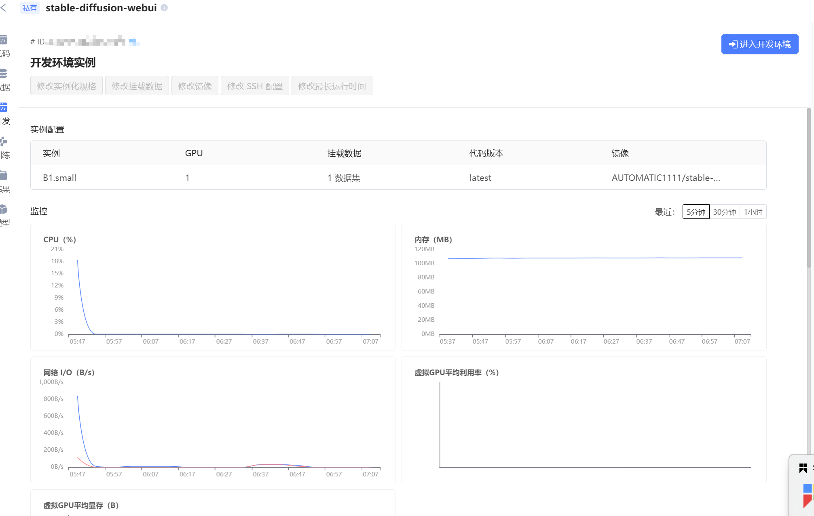
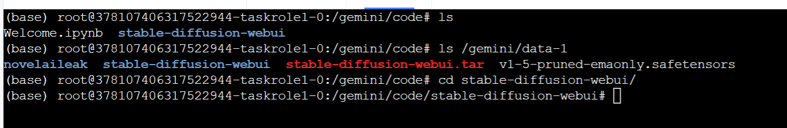
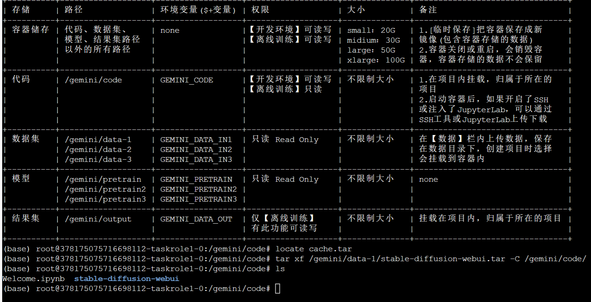
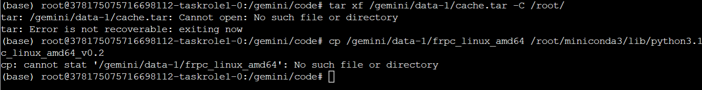
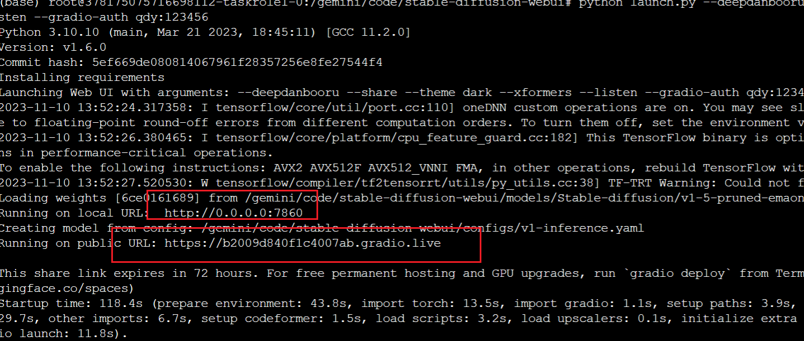
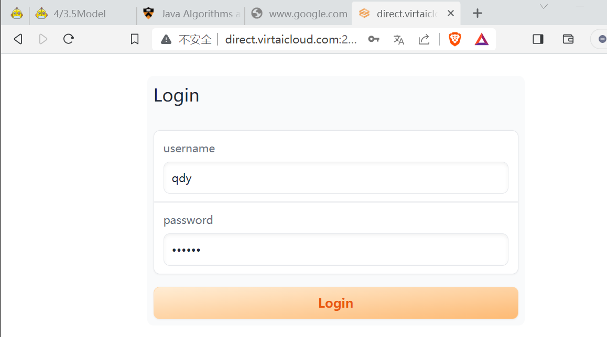
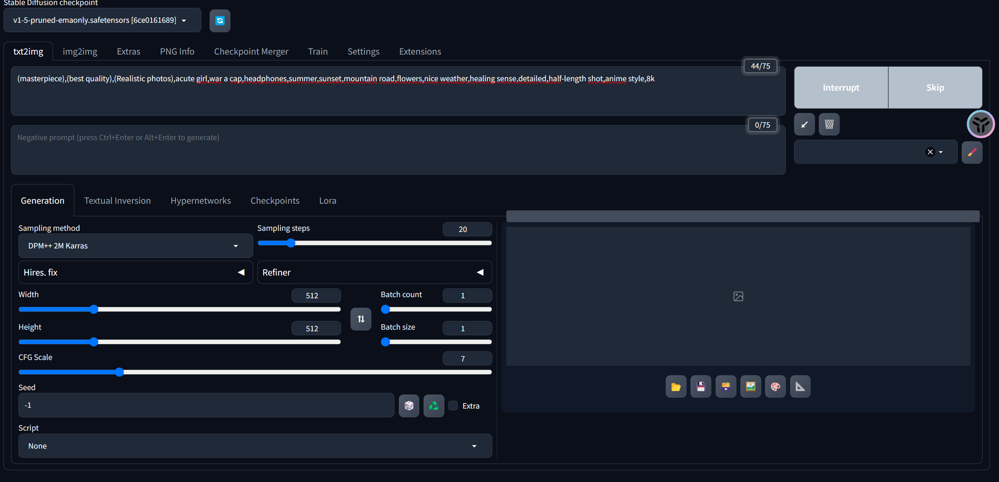
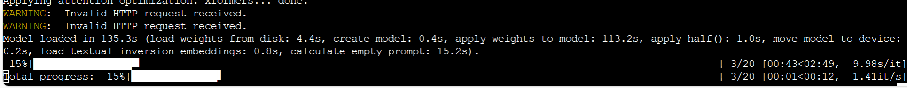

# 部署stable-diffusion

- 创建镜像实例



- 解压代码,

```shell
tar xf /gemini/data-1/stable-diffusion-webui.tar -C /gemini/code/

# 报错可以跳过这一行
tar xf /gemini/data-1/cache.tar -C /root/
```



- 外网访问

```shell
cp /gemini/data-1/frpc_linux_amd64 /root/miniconda3/lib/python3.10/site-packages/gradio/frpc_linux_amd64_v0.2

chmod +x /root/miniconda3/lib/python3.10/site-packages/gradio/frpc_linux_amd64_v0.2
```

穿透工具貌似在文件夹内找不到,先运行看看

- 运行项目

```shell
cd /gemini/code/stable-diffusion-webui

python launch.py --deepdanbooru --share --theme dark --xformers --listen --gradio-auth qdy:123456

```

- 运行失败, 因为镜像没有13G只有10G的, 同时其中也没有frpc穿透工具,报错如下

```shell
Python 3.10.10 (main, Mar 21 2023, 18:45:11) [GCC 11.2.0]
Version: v1.6.0
Commit hash: 5ef669de080814067961f28357256e8fe27544f4
Installing clip
Installing xformers
Installing requirements for CodeFormer
Installing requirements
Launching Web UI with arguments: --deepdanbooru --share --theme dark --xformers --listen --gradio-auth qdy:123456

===================================BUG REPORT===================================
Welcome to bitsandbytes. For bug reports, please run

python -m bitsandbytes

 and submit this information together with your error trace to: https://github.com/TimDettmers/bitsandbytes/issues
================================================================================
bin /root/miniconda3/lib/python3.10/site-packages/bitsandbytes/libbitsandbytes_cuda118.so
/root/miniconda3/lib/python3.10/site-packages/bitsandbytes/cuda_setup/main.py:149: UserWarning: /root/miniconda3 did not contain ['libcudart.so', 'libcudart.so.11.0', 'libcudart.so.12.0'] as expected! Searching further paths...
  warn(msg)
/root/miniconda3/lib/python3.10/site-packages/bitsandbytes/cuda_setup/main.py:149: UserWarning: WARNING: The following directories listed in your path were found to be non-existent: {PosixPath('/usr/lib/orion')}
  warn(msg)
/root/miniconda3/lib/python3.10/site-packages/bitsandbytes/cuda_setup/main.py:149: UserWarning: /opt/orion/orion_runtime/lib:/usr/lib64:/usr/lib:/usr/lib/orion did not contain ['libcudart.so', 'libcudart.so.11.0', 'libcudart.so.12.0'] as expected! Searching further paths...
  warn(msg)
/root/miniconda3/lib/python3.10/site-packages/bitsandbytes/cuda_setup/main.py:149: UserWarning: WARNING: The following directories listed in your path were found to be non-existent: {PosixPath('"wqubxwo3rzmo","user_id"'), PosixPath('{"name"'), PosixPath('150,"memory"'), PosixPath('5004","username"'), PosixPath('{"data_type"'), PosixPath('"Dataset"}],"code_repository"'), PosixPath('1,"image"'), PosixPath('100,"storage"'), PosixPath('"wqubxwo3rzmo/1313-20230818202023'), PosixPath('2,"parameters"'), PosixPath('"taskrole1","instances"'), PosixPath('"/gemini/data-1","access_info"'), PosixPath('22}],"extensions"'), PosixPath('{"baseUrl"'), PosixPath('8888\\",\\"cluster_external_address\\"'), PosixPath('22602\\"}","data_path"'), PosixPath('3600,"spec_name"'), PosixPath('[{"name"'), PosixPath('6062,"idle_time"'), PosixPath('"B1.gpu.small"},"cache"'), PosixPath('"code","type"'), PosixPath('"349896193502875648","version"'), PosixPath('"/pavostor/gemini/codeset/rtutwioqvz4b/378107163043696640/latest","read_only"'), PosixPath('"/gemini_web/gemini_jupyterlab/~direct.virtaicloud.com~31443~/378107406317522944","port"'), PosixPath('[{"ext_type"'), PosixPath('"latest"},"data_type_name"'), PosixPath('"ROODqJ4XMHH6bCQ8dYiZjg=="},"resource"'), PosixPath('1,"ratio"'), PosixPath('"Codeset"},{"name"'), PosixPath('"NVIDIA GeForce RTX 3090","count"'), PosixPath('"storage-docker-registry-agent.gemini-comp'), PosixPath('{"image_name"'), PosixPath('{}},"data_storage"'), PosixPath('"data-1","type"'), PosixPath('"/gemini/codeset/rtutwioqvz4b/378107163043696640/latest","data_type_name"'), PosixPath('[{"http_port"'), PosixPath('12288,"memCommitCent"'), PosixPath('25,"memory"'), PosixPath('{"cpu"'), PosixPath('"{\\"cluster_internal_address\\"'), PosixPath('{},"instance_ports"'), PosixPath('20480,"gpu"'), PosixPath('{"type"'), PosixPath('{},"vgpu"'), PosixPath('"8888"}}]}'), PosixPath('80,"ssh_port"'), PosixPath('"/gemini/code","access_info"'), PosixPath('"traindata","space_id"'), PosixPath('"1313","data_id"'), PosixPath('22602\\"}","data_location"'), PosixPath('"/Gemini-Snapshot/traindata/wqubxwo3rzmo/1313/349896193502875648/latest","read_only"'), PosixPath('"system","password"'), PosixPath('"weed","path"'), PosixPath('4,"cpuCommitCent"'), PosixPath('"true","mount_path"'), PosixPath('\\"seaweedfs-filer.gemini-storage'), PosixPath('\\"direct.virtaicloud.com'), PosixPath('20230818202023","registry"'), PosixPath('"false","mount_path"')}
  warn(msg)
/root/miniconda3/lib/python3.10/site-packages/bitsandbytes/cuda_setup/main.py:149: UserWarning: WARNING: The following directories listed in your path were found to be non-existent: {PosixPath('/gemini/pretrain')}
  warn(msg)
/root/miniconda3/lib/python3.10/site-packages/bitsandbytes/cuda_setup/main.py:149: UserWarning: WARNING: The following directories listed in your path were found to be non-existent: {PosixPath('//10.96.0.1'), PosixPath('tcp'), PosixPath('443')}
  warn(msg)
/root/miniconda3/lib/python3.10/site-packages/bitsandbytes/cuda_setup/main.py:149: UserWarning: WARNING: The following directories listed in your path were found to be non-existent: {PosixPath('用户需知：请提前阅读本文档\\n+----------+-------------------+------------------+-------------------+--------------+--------------------------------+\\n| 存储     | 路径              | 环境变量($+变量) | 权限              | 大小         | 备注                           |\\n+----------+-------------------+------------------+-------------------+--------------+--------------------------------+\\n| 容器储存 | 代码、数据集、    | none             |【开发环境】可读写 | small：20G   | 1.[临时保存]把容器保存成新     |\\n|          | 模型、结果集路径  |                  |【离线训练】可读写 | midium：30G  | 镜像(包含容器存储的数据)       |\\n|          | 以外的所有路径    |                  |                   | large：50G   | 2.容器关闭或重启，会销毁容     |\\n|          |                   |                  |                   | xlarge：100G | 器，容器存储的数据不会保留     |\\n+----------+-------------------+------------------+-------------------+--------------+--------------------------------+\\n| 代码     | /gemini/code      | GEMINI_CODE      |【开发环境】可读写 | 不限制大小   | 1.在项目内挂载，归属于所在的   |\\n|          |                   |                  |【离线训练】只读   |              | 项目                           |\\n|          |                   |                  |                   |              | 2.启动容器后，如果开启了SSH    |\\n|          |                   |                  |                   |              | 或注入了JupyterLab，可以通过   |\\n|          |                   |                  |                   |              | SSH工具或JupyterLab上传下载    |\\n+----------+-------------------+------------------+-------------------+--------------+--------------------------------+\\n| 数据集   | /gemini/data-1    | GEMINI_DATA_IN1  | 只读 Read Only    | 不限制大小   | 在【数据】栏内上传数据，保存   |\\n|          | /gemini/data-2    | GEMINI_DATA_IN2  |                   |              | 在数据目录下，创建项目时选择   |\\n|          | /gemini/data-3    | GEMINI_DATA_IN3  |                   |              | 会挂载到容器内                 |\\n+----------+-------------------+------------------+-------------------+--------------+--------------------------------+\\n| 模型     | /gemini/pretrain  | GEMINI_PRETRAIN  | 只读 Read Only    | 不限制大小   | none                           |\\n|          | /gemini/pretrain2 | GEMINI_PRETRAIN2 |                   |              |                                |\\n|          | /gemini/pretrain3 | GEMINI_PRETRAIN3 |                   |              |                                |\\n+----------+-------------------+------------------+-------------------+--------------+--------------------------------+\\n| 结果集   | /gemini/output    | GEMINI_DATA_OUT  | 仅【离线训练】    | 不限制大小   | 挂载在项目内，归属于所在的项目 |\\n|          |                   |                  | 有此功能可读写    |              |                                |\\n+----------+-------------------+------------------+-------------------+--------------+--------------------------------+')}
  warn(msg)
/root/miniconda3/lib/python3.10/site-packages/bitsandbytes/cuda_setup/main.py:149: UserWarning: WARNING: The following directories listed in your path were found to be non-existent: {PosixPath('/gemini/output')}
  warn(msg)
/root/miniconda3/lib/python3.10/site-packages/bitsandbytes/cuda_setup/main.py:149: UserWarning: WARNING: The following directories listed in your path were found to be non-existent: {PosixPath('tcp'), PosixPath('//10.106.34.202'), PosixPath('8888')}
  warn(msg)
/root/miniconda3/lib/python3.10/site-packages/bitsandbytes/cuda_setup/main.py:149: UserWarning: WARNING: The following directories listed in your path were found to be non-existent: {PosixPath('/gemini/data-3')}
  warn(msg)
/root/miniconda3/lib/python3.10/site-packages/bitsandbytes/cuda_setup/main.py:149: UserWarning: WARNING: The following directories listed in your path were found to be non-existent: {PosixPath('/gemini/data-2')}
  warn(msg)
/root/miniconda3/lib/python3.10/site-packages/bitsandbytes/cuda_setup/main.py:149: UserWarning: WARNING: The following directories listed in your path were found to be non-existent: {PosixPath('/gemini/predata')}
  warn(msg)
/root/miniconda3/lib/python3.10/site-packages/bitsandbytes/cuda_setup/main.py:149: UserWarning: WARNING: The following directories listed in your path were found to be non-existent: {PosixPath('/gemini/pretrain2')}
  warn(msg)
/root/miniconda3/lib/python3.10/site-packages/bitsandbytes/cuda_setup/main.py:149: UserWarning: WARNING: The following directories listed in your path were found to be non-existent: {PosixPath('/gemini/pretrain3')}
  warn(msg)
CUDA_SETUP: WARNING! libcudart.so not found in any environmental path. Searching in backup paths...
/root/miniconda3/lib/python3.10/site-packages/bitsandbytes/cuda_setup/main.py:149: UserWarning: Found duplicate ['libcudart.so', 'libcudart.so.11.0', 'libcudart.so.12.0'] files: {PosixPath('/usr/local/cuda/lib64/libcudart.so.11.0'), PosixPath('/usr/local/cuda/lib64/libcudart.so')}.. We'll flip a coin and try one of these, in order to fail forward.
Either way, this might cause trouble in the future:
If you get `CUDA error: invalid device function` errors, the above might be the cause and the solution is to make sure only one ['libcudart.so', 'libcudart.so.11.0', 'libcudart.so.12.0'] in the paths that we search based on your env.
  warn(msg)
CUDA SETUP: CUDA runtime path found: /usr/local/cuda/lib64/libcudart.so.11.0
CUDA SETUP: Highest compute capability among GPUs detected: 8.6
CUDA SETUP: Detected CUDA version 118
CUDA SETUP: Loading binary /root/miniconda3/lib/python3.10/site-packages/bitsandbytes/libbitsandbytes_cuda118.so...
2023-11-10 09:29:14.149965: I tensorflow/core/util/port.cc:110] oneDNN custom operations are on. You may see slightly different numerical results due to floating-point round-off errors from different computation orders. To turn them off, set the environment variable `TF_ENABLE_ONEDNN_OPTS=0`.
2023-11-10 09:29:16.349107: I tensorflow/core/platform/cpu_feature_guard.cc:182] This TensorFlow binary is optimized to use available CPU instructions in performance-critical operations.
To enable the following instructions: AVX2 AVX512F AVX512_VNNI FMA, in other operations, rebuild TensorFlow with the appropriate compiler flags.
2023-11-10 09:29:17.576931: W tensorflow/compiler/tf2tensorrt/utils/py_utils.cc:38] TF-TRT Warning: Could not find TensorRT
Loading weights [6ce0161689] from /gemini/code/stable-diffusion-webui/models/Stable-diffusion/v1-5-pruned-emaonly.safetensors
Running on local URL:  http://0.0.0.0:7860
Creating model from config: /gemini/code/stable-diffusion-webui/configs/v1-inference.yaml
creating model quickly: OSError
Traceback (most recent call last):
  File "/root/miniconda3/lib/python3.10/threading.py", line 973, in _bootstrap
    self._bootstrap_inner()
  File "/root/miniconda3/lib/python3.10/threading.py", line 1016, in _bootstrap_inner
    self.run()
  File "/root/miniconda3/lib/python3.10/threading.py", line 953, in run
    self._target(*self._args, **self._kwargs)
  File "/gemini/code/stable-diffusion-webui/modules/initialize.py", line 147, in load_model
    shared.sd_model  # noqa: B018
  File "/gemini/code/stable-diffusion-webui/modules/shared_items.py", line 110, in sd_model
    return modules.sd_models.model_data.get_sd_model()
  File "/gemini/code/stable-diffusion-webui/modules/sd_models.py", line 499, in get_sd_model
    load_model()
  File "/gemini/code/stable-diffusion-webui/modules/sd_models.py", line 602, in load_model
    sd_model = instantiate_from_config(sd_config.model)
  File "/gemini/code/stable-diffusion-webui/repositories/stable-diffusion-stability-ai/ldm/util.py", line 89, in instantiate_from_config
    return get_obj_from_str(config["target"])(**config.get("params", dict()))
  File "/gemini/code/stable-diffusion-webui/repositories/stable-diffusion-stability-ai/ldm/models/diffusion/ddpm.py", line 563, in __init__
    self.instantiate_cond_stage(cond_stage_config)
  File "/gemini/code/stable-diffusion-webui/repositories/stable-diffusion-stability-ai/ldm/models/diffusion/ddpm.py", line 630, in instantiate_cond_stage
    model = instantiate_from_config(config)
  File "/gemini/code/stable-diffusion-webui/repositories/stable-diffusion-stability-ai/ldm/util.py", line 89, in instantiate_from_config
    return get_obj_from_str(config["target"])(**config.get("params", dict()))
  File "/gemini/code/stable-diffusion-webui/repositories/stable-diffusion-stability-ai/ldm/modules/encoders/modules.py", line 103, in __init__
    self.tokenizer = CLIPTokenizer.from_pretrained(version)
  File "/root/miniconda3/lib/python3.10/site-packages/transformers/tokenization_utils_base.py", line 1809, in from_pretrained
    raise EnvironmentError(
OSError: Can't load tokenizer for 'openai/clip-vit-large-patch14'. If you were trying to load it from 'https://huggingface.co/models', make sure you don't have a local directory with the same name. Otherwise, make sure 'openai/clip-vit-large-patch14' is the correct path to a directory containing all relevant files for a CLIPTokenizer tokenizer.

Failed to create model quickly; will retry using slow method.
loading stable diffusion model: OSError
Traceback (most recent call last):
  File "/root/miniconda3/lib/python3.10/threading.py", line 973, in _bootstrap
    self._bootstrap_inner()
  File "/root/miniconda3/lib/python3.10/threading.py", line 1016, in _bootstrap_inner
    self.run()
  File "/root/miniconda3/lib/python3.10/threading.py", line 953, in run
    self._target(*self._args, **self._kwargs)
  File "/gemini/code/stable-diffusion-webui/modules/initialize.py", line 147, in load_model
    shared.sd_model  # noqa: B018
  File "/gemini/code/stable-diffusion-webui/modules/shared_items.py", line 110, in sd_model
    return modules.sd_models.model_data.get_sd_model()
  File "/gemini/code/stable-diffusion-webui/modules/sd_models.py", line 499, in get_sd_model
    load_model()
  File "/gemini/code/stable-diffusion-webui/modules/sd_models.py", line 611, in load_model
    sd_model = instantiate_from_config(sd_config.model)
  File "/gemini/code/stable-diffusion-webui/repositories/stable-diffusion-stability-ai/ldm/util.py", line 89, in instantiate_from_config
    return get_obj_from_str(config["target"])(**config.get("params", dict()))
  File "/gemini/code/stable-diffusion-webui/repositories/stable-diffusion-stability-ai/ldm/models/diffusion/ddpm.py", line 563, in __init__
    self.instantiate_cond_stage(cond_stage_config)
  File "/gemini/code/stable-diffusion-webui/repositories/stable-diffusion-stability-ai/ldm/models/diffusion/ddpm.py", line 630, in instantiate_cond_stage
    model = instantiate_from_config(config)
  File "/gemini/code/stable-diffusion-webui/repositories/stable-diffusion-stability-ai/ldm/util.py", line 89, in instantiate_from_config
    return get_obj_from_str(config["target"])(**config.get("params", dict()))
  File "/gemini/code/stable-diffusion-webui/repositories/stable-diffusion-stability-ai/ldm/modules/encoders/modules.py", line 103, in __init__
    self.tokenizer = CLIPTokenizer.from_pretrained(version)
  File "/root/miniconda3/lib/python3.10/site-packages/transformers/tokenization_utils_base.py", line 1809, in from_pretrained
    raise EnvironmentError(
OSError: Can't load tokenizer for 'openai/clip-vit-large-patch14'. If you were trying to load it from 'https://huggingface.co/models', make sure you don't have a local directory with the same name. Otherwise, make sure 'openai/clip-vit-large-patch14' is the correct path to a directory containing all relevant files for a CLIPTokenizer tokenizer.


Stable diffusion model failed to load
Applying attention optimization: xformers... done.
```

- 删除项目,重新安装镜像, 并输入解压命令



- 仍然没有文件



- 直接运行launch.py, 仍然报错

```shell
(base) root@378175075716698112-taskrole1-0:/gemini/code/stable-diffusion-webui# python launch.py --deepdanbooru --share --theme dark --xformers --listen --gradio-auth qdy:123456
Python 3.10.10 (main, Mar 21 2023, 18:45:11) [GCC 11.2.0]
Version: v1.6.0
Commit hash: 5ef669de080814067961f28357256e8fe27544f4
Installing requirements for CodeFormer
Launching Web UI with arguments: --deepdanbooru --share --theme dark --xformers --listen --gradio-auth qdy:123456
2023-11-10 13:40:54.431948: I tensorflow/core/util/port.cc:110] oneDNN custom operations are on. You may see slightly different numerical results due to floating-point round-off errors from different computation orders. To turn them off, set the environment variable `TF_ENABLE_ONEDNN_OPTS=0`.
2023-11-10 13:40:58.533841: I tensorflow/core/platform/cpu_feature_guard.cc:182] This TensorFlow binary is optimized to use available CPU instructions in performance-critical operations.
To enable the following instructions: AVX2 AVX512F AVX512_VNNI FMA, in other operations, rebuild TensorFlow with the appropriate compiler flags.
2023-11-10 13:40:59.930553: W tensorflow/compiler/tf2tensorrt/utils/py_utils.cc:38] TF-TRT Warning: Could not find TensorRT
Traceback (most recent call last):
  File "/gemini/code/stable-diffusion-webui/launch.py", line 48, in <module>
    main()
  File "/gemini/code/stable-diffusion-webui/launch.py", line 44, in main
    start()
  File "/gemini/code/stable-diffusion-webui/modules/launch_utils.py", line 432, in start
    import webui
  File "/gemini/code/stable-diffusion-webui/webui.py", line 13, in <module>
    initialize.imports()
  File "/gemini/code/stable-diffusion-webui/modules/initialize.py", line 21, in imports
    import gradio  # noqa: F401
  File "/root/miniconda3/lib/python3.10/site-packages/gradio/__init__.py", line 3, in <module>
    import gradio.components as components
  File "/root/miniconda3/lib/python3.10/site-packages/gradio/components/__init__.py", line 1, in <module>
    from gradio.components.annotated_image import AnnotatedImage
  File "/root/miniconda3/lib/python3.10/site-packages/gradio/components/annotated_image.py", line 12, in <module>
    from gradio import utils
  File "/root/miniconda3/lib/python3.10/site-packages/gradio/utils.py", line 353, in <module>
    class AsyncRequest:
  File "/root/miniconda3/lib/python3.10/site-packages/gradio/utils.py", line 372, in AsyncRequest
    client = httpx.AsyncClient()
  File "/root/miniconda3/lib/python3.10/site-packages/httpx/_client.py", line 1397, in __init__
    self._transport = self._init_transport(
  File "/root/miniconda3/lib/python3.10/site-packages/httpx/_client.py", line 1445, in _init_transport
    return AsyncHTTPTransport(
  File "/root/miniconda3/lib/python3.10/site-packages/httpx/_transports/default.py", line 275, in __init__
    self._pool = httpcore.AsyncConnectionPool(
TypeError: AsyncConnectionPool.__init__() got an unexpected keyword argument 'socket_options'
```

查找github issue

[TypeError: AsyncConnectionPool.__init__(), new install bug, httpx==0.24.1 · Issue #13840 · AUTOMATIC1111/stable-diffusion-webui (github.com)](https://github.com/AUTOMATIC1111/stable-diffusion-webui/issues/13840)

提示是httpx版本问题, pip install后

再次运行


成功



# 运行stable-diffusion



prompt

> (masterpiece),(best quality),(Realistic photos),acute girl,war a cap,headphones,summer,sunset,mountain road,flowers,nice weather,healing sense,detailed,half-length shot,anime style,8k






成功